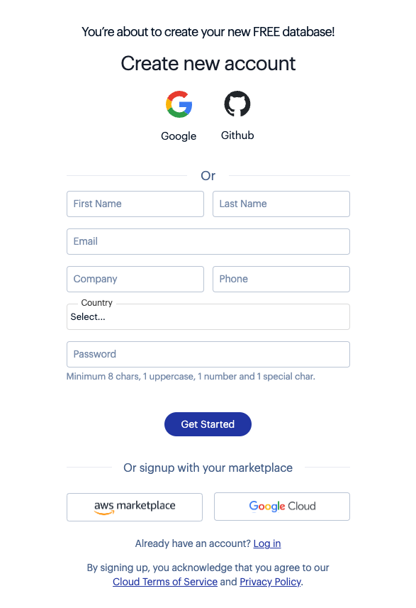

# Redis as an in-memory data sturcutre store quick start guide

기본 레디스 데이터 타입을 어떻게 사용하는지 이해한다.

이 퀵 스타트 가이드는 아래 항목을 알려준다.

1. 레디스를 시작
1. 레디스에서 키로 데이터를 저장
1. 레디스에서 키로 데이터를 가져오기
1. 키를 특정 패턴을 사용해서 키스페이스에서 스캔

## Setup

레디스를 시작하는 가장 쉬운 방법은 레디스 클라우드를 사용하는 것이다.

1. 무료 계정을 만든다.
    
1. 아래 설명을 통해 무료 데이터베이스를 만든다.

[installation guides](https://redis.io/docs/latest/develop/get-started/data-store/#:~:text=alternatively%20follow%20the-,installation%20guides,-to%20install%20Redis)를 참고해서 로컬 머신에 레디스를 설치할수도 있다.

## Connect

첫 번째 단계는 레디스에 접속하는 것이다. [Tool Section](https://redis.io/docs/latest/develop/get-started/data-store/#:~:text=this%20documentation%20site%27s-,Tools%20section,-.%20The%20following%20example)에서 더 자세한 커넥션 옵션을 확인할 수 있다. 아래 예제는 로컬 호스트(-h 127.0.0.1)의 기본 포트(-p 6379)에 listen하고 있는 레디스 서버에 어떻게 접속하는지에 대한 예제이다.

```
redis-cli -h 127.0.0.1 -p 6379
```

