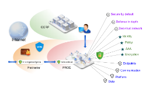

# Security

모놀리스 애플리케이션을 아토믹 서비스로 전환하는 것은 다양한 이점이 있다. 더 좋은 애자일 성과 확장성, 서비스 재사용성을 얻을 수 있다. 그러나 마이크로서비스에선 특정 보안 요구사항이 있다.

* man-in-the-middle 공격을 방어하기위해 트래픽 인크립션이 필요하다.
* 서비스 접근을 유연하게 제어하기 위해 mutual TLS와 세밀한 정책 제어가 필요하다.
* 누가 언제 무엇을 했는지 식별하기 위해 감사 도구가 필요하다.

이스티오의 보안은 이러한 문제를 해결하기 위한 종합적인 보안 솔루션을 제공한다. 이 페이지에선 서비스들을 안전하게 하기 위해 이스티오의 어떤 보안 설정들을 사용하고 동작시킬 수 있는지 살펴본다. 특히 이스티오는 내, 외부간 데이터, 엔드포인트, 커뮤니케이션, 플랫폼 위협을 완화한다.

이스티오의 보안 기능은 강력한 identity, 정채r, transparent TLS 암호화, 인증, 인가와 감사(AAA)를 제공하여 서비스와 데이터를 보호한다. 이스티오의 보안 목적은

*