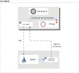

# Security

모놀리스 애플리케이션을 아토믹 서비스로 전환하는 것은 다양한 이점이 있다. 더 좋은 애자일 성과 확장성, 서비스 재사용성을 얻을 수 있다. 그러나 마이크로서비스에선 특정 보안 요구사항이 있다.

* man-in-the-middle 공격을 방어하기위해 트래픽 인크립션이 필요하다.
* 서비스 접근을 유연하게 제어하기 위해 mutual TLS와 세밀한 정책 제어가 필요하다.
* 누가 언제 무엇을 했는지 식별하기 위해 감사 도구가 필요하다.

이스티오의 보안은 이러한 문제를 해결하기 위한 종합적인 보안 솔루션을 제공한다. 이 페이지에선 서비스들을 안전하게 하기 위해 이스티오의 어떤 보안 설정들을 사용하고 동작시킬 수 있는지 살펴본다. 특히 이스티오는 내, 외부간 데이터, 엔드포인트, 커뮤니케이션, 플랫폼 위협을 완화한다.

이스티오의 보안 기능은 강력한 identity, 정채, transparent TLS 암호화, 인증, 인가와 감사(AAA)를 제공하여 서비스와 데이터를 보호한다. 이스티오의 보안 목적은

* 기본 보안 기능 : 인프라스트럭쳐와 애플리케이션의 변경을 필요로 하지 않음
* Defense in depth : 여러 레이어의 보안을 제공하기 위한 기존 보안 시스템과의 통합
* 제로-트러스트 네트워크 : 분산 네트워크상의 보안 솔루션 빌드

배포된 서비스에 이스티오의 시큐리티 기능을 적용하기 위해 [mutual TLS Migration docs](https://istio.io/latest/docs/concepts/security/#:~:text=mutual%20TLS%20Migration%20docs)를 검토해라. [Security Tasks](https://istio.io/latest/docs/concepts/security/#:~:text=services.%20Visit%20our-,Security%20Tasks,-for%20detailed%20instructions)에서 보안 기능을 사용하는 세부적인 내용을 확인할 수 있다.

## High-level architecture

이스티오의 시큐리티 기능은 여러 컴포넌트들로 이루어져있다

* A Certificate Authority (CA) for key and certificate management
* 아래 항목들을 배포하는 환경설정 API 서버
  * 인증, 인가 정책
  * 보안 네이밍 정보
* 클라이언트-서버간 보안 통신을 위한 Policy Enforcement Points(PEPs)로 동작하는 사이드카와 경계 프록시
* 메트릭 측정과 감사를 관리할 수 있는 엔보이 프록시 확장

컨트롤 플레인은 API 서버로부터 환경설정을 핸들링하고 데이터 플레인의 PEPs를 설정한다. PEPs는 엔보이에 의해 구현된다. 아래 다이어그램이 아키텍쳐를 보여준다.

다음 섹션에서 시큐리티 기능의 세부사항을 소개한다.

## Istio identity

신원 확인은 어떠한 보안 인프라스트럭쳐에서 가장 기본적이다. 워크로드 간 커뮤니케이션이 시작될 때 두 당사자는 상호 인증을 목적으로 하는 신원 확인 정보가 포함된 크리덴션을 교환한다. 클라이언트 사이드에서 서버의 신원을 secure naming 정보와 비교하여 승인된 워크로드 러너인지 확인한다. 서버는 인가 정책을 기반으로 클라이언트가 어떤 정보에 접근할 수 있는지 확인하고 언제, 어떤 정보에 접속했는지 감사하며, 클라이언트가 사용한 워크로드를 기반으로 청구하고, 지불하지 못한 클라이언트의 엑세스를 차단한다.

이스티오의 신원 인증 모델은 service identity라는 first-class를 사용해서 요청에 대한 origin의 신원을 구분한다. 이 모델은 그룹 또는 개별 워크로드나 휴먼 유저를 표현하기 위한 service identity를 위한 훌륭한 유연성과 세분성을 보여준다. 플랫폼상에 service identity가 없으면 이스티오는 service name 같은 워크로드 인스턴스 그룹을 사용해서 이를 구분한다.

아래 목록은 다양한 플랫폼에서 사용할 수 있는 service identity이다.

* Kubernetes : Kubernetes service account
* GCE : GCP service account
* On-premises (non-Kubernetes): user account, custom service account, service name, Istio service account, or GCP service account. The custom service account refers to the existing service account just like the identities that the customer’s Identity Directory manages.

## 신원 인증과 인증서 관리

이스티오는 X.509 인증서를 사용해서 모든 워크로드에 강력한 신원인증을 안전하게 제공한다. 각각의 엔보이 프록시측에서 구동하는 이스티오 에이전트는 `istiod`와 같이 구동하며 대규모로 인증서와 키 교환을 자동화한다. 아래 다이어그램은 신원인증 프로비저닝 플로우에 대해 보여준다.

이스티오는 아래의 절차를 ㅡ따라 키와 인증서를 프로비저닝한다.

1. `istiod`는 